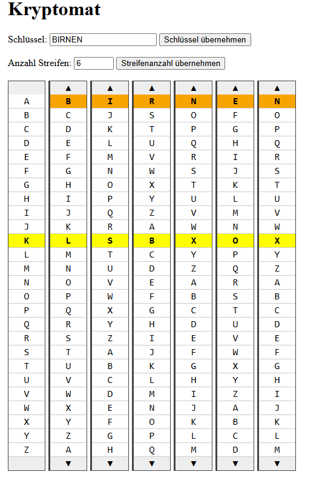

# Kryptomat
Veranschaulichung einer Verschlüsselungsmaschine

Ein interaktives Tool zum Probieren und Verstehen einer polyalphabetisachen Verschlüsselung 

## 🔍 Funktionen

- Eingabe eines Schlüssels - Bildung von Streifen/Walzen
- Eingabe einer Schlüssellänge - Anzeige von Streifen/Walzen
- Verschieben der Streifen bzw. Drehen der Walzen mit Anpassung des Schlüssels
- Hervorhebung des Schlüssels und der zum klartextbuchstaben gehörigen Verschlüsselungsbuchstaben

## 🖼️ Screenshot



## 🚀 Online ausprobieren

> Wird unterstützt durch **GitHub Pages**.

👉 [Hier klicken, um das Projekt direkt im Browser zu starten](https://tonitaste.github.io/Robby/index.html)

## 📦 Installation (lokal)

Du kannst das Projekt lokal starten, indem du die Dateien einfach in einen Ordner speicherst und `index.html` in einem Browser öffnest:

```bash
git clone https://github.com/ToniTaste/Kryptomat.git
cd Kryptomat
# Dann: index.html im Browser öffnen
